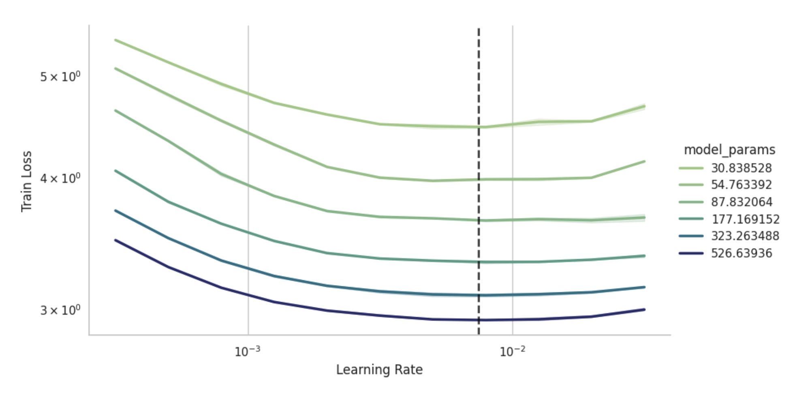
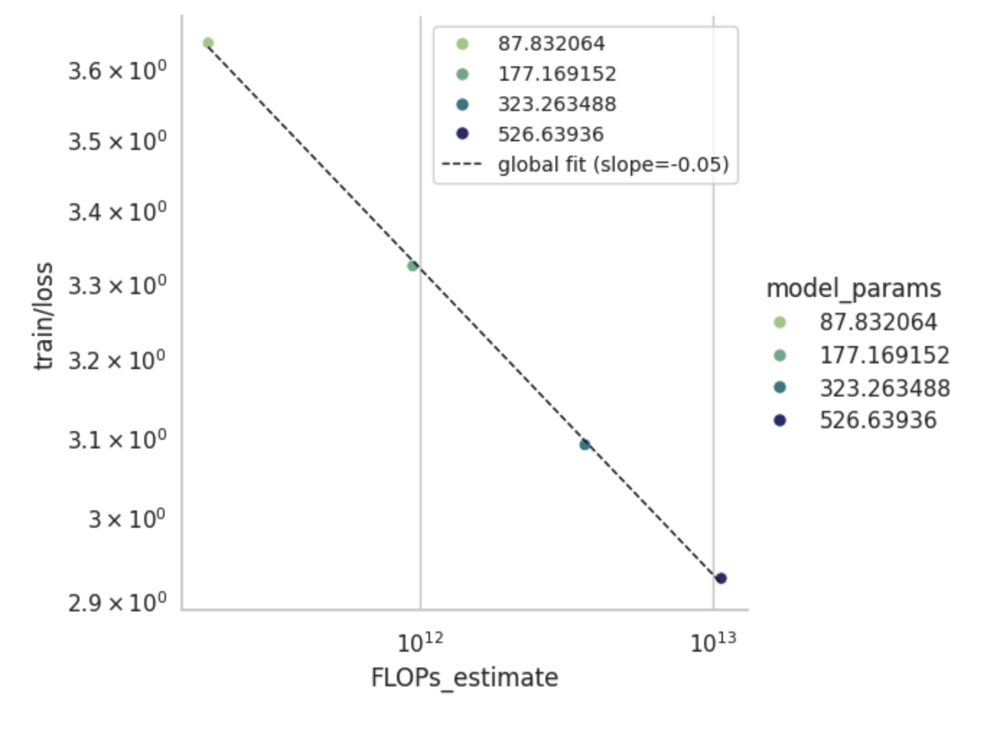
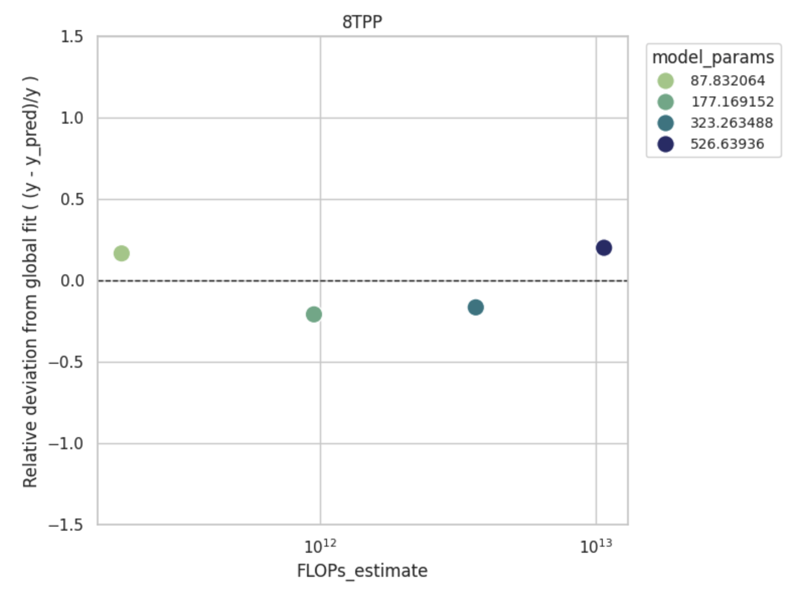

# $\mu$P + GQA Report
This document serves as a snapshot into the current state of progress of our $\mu$P + GQA implementation. We refer to our paper draft for more detail.

## Derivations
The following table is our current derivation for implementing $\mu$P. $n$ is the embedding dimension, $L$ the model depth, and $r$ is the kv repetitions, i.e. the key and value weight matrices are of size $\frac{n}{r}\times n$.

| Layer | $\mu$P | xLLM-$\mu$P |
|-------|--------|-------------|
| Embedding Init. Std. Dev.     | 1 | $1/n$ |
| Embedding Learning Rate       | 1 | $1/n$ |
| Embedding Weight Decay        | 1 | $n$ |
| Embedding Forward Mult.       | 1 | $n$ |
| Hidden Init. Std. Dev.        | $1/\sqrt{n}$ | $1/\sqrt{n}$ |
| Hidden Learning Rate          | $1/n$ | $1/n$ |
| Hidden Weight Decay           | $n$ | $n$ |
| Hidden Forward Mult.          | $1$ | $1$ |
| KV Init. Std. Dev.            | $1/\sqrt{n}$ | $\frac{1+\sqrt{r}}{2n}$ |
| KV Learning Rate              | $\frac{1+\sqrt{r}}{2n}$ | $1/n$ |
| KV Weight Decay               | $\frac{2n}{1 + \sqrt{r}}$ | $n$ |
| KV Forward Mult.              | $1$ | $\frac{1}{1 + \sqrt{r}}$ |
| Unembedding Init. Std. Dev.   | 1 | $1/n$ |
| Unembedding Learning Rate     | 1 | $1/n$ |
| Unembedding Weight Decay      | 1 | $n$ |
| Unembedding Forward Mult.     | $1/n$ | $1$ |
| Attention Scaling             | $1/d$ | $1/d$ |
| Residual Block Scaling        | $L^{1} | L^{-1} |

## Preliminary Results
The following preliminary results were obtained through scaling hidden dimension, depth, and gqa parameters. We get a nice linear fit of the model performance as we scale up.

We get almost perfect $\mu$-transfer:

We have the following scaling law

and deviation from that scaling law

